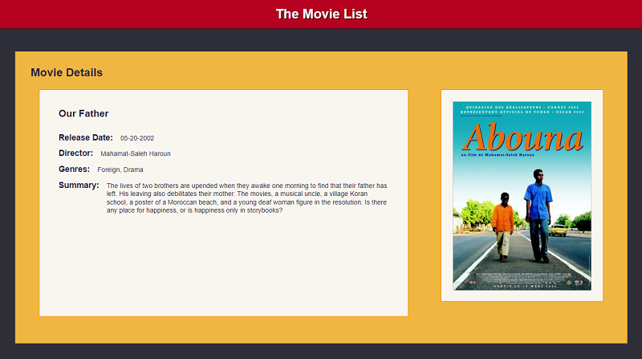
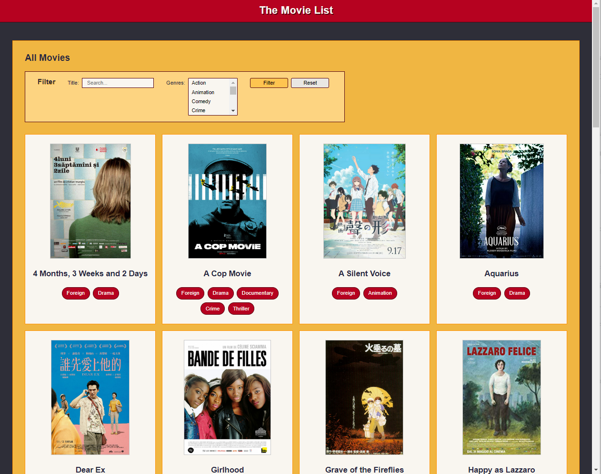

# Module Assessment - Part 2: Vue

## Introduction

This part of the hands-on assessment starts with an existing Vue project where some features are incomplete. There are five independent tasks required for you to complete the current application features.

**After completing this part, you need to `add`, `commit`, and `push` the code to your repository. When you've completed both parts of the coding assessment, submit your assessment in BootcampOS.**

## Hints and suggestions

* Each of the feature updates is independent of the others. If you become stuck on one feature, make some notes in comments, commenting out any code that prevents the application from building and running, then move on to the next feature. You can revisit this work later, if you have time.
* `push` your code often. Whenever you reach a point where you feel like you've made good progress and your code builds, commit and push your changes.
* The code you submit must build properly to get scored. _Please make sure you don't have any build errors._

## Exploring the code

Build and run the Vue application.

There are two application views in the `views` folder:

- The **All Movies** view is the main view shown for the application. It includes a search filter and a list of matching movies. Currently the movies display as text only, but notice that the filter does properly filter the list of movies.

- The **Movie Details** view is initially only accessible by entering the URL http://localhost:8080/movies/details on the browser address bar. This view currently always shows the details for the movie **Our Father**.


## Requirements

### Task 1: Create an `AppHeader` component

Currently the application header is part of the template and styles in the `App.vue` component. The plan is to add new features to the application header in the next release. To prepare for that work, make the application header a separate component. 

Create a new Vue component called `AppHeader` and move the existing `#app-header` element and its related styles to the new component file. Import and use the new component in `App.vue`. 

> Note: This task doesn't visually change the application. It's only a behind the scenes structural code change. 


### Task 2: Improve styling for the `MovieDetails` component

The current `MovieDetails` component is hard to read due to a low contrast between the background and font colors. Update the component styling to add a solid background behind the movie details text and poster. 

- For the background, use the color `#F9F6F0`
- Add a 1 pixel border to the solid background using the color `#FF9000`

When completed correctly, the **MovieDetailsView** displays similar to the following image, although the position of movie poster may different based on the width of the browser display.




### Task 3: Update the list of genres in the `MovieFilter` component

The `MovieFilter` component currently uses a hard-coded list of 3 genres. Update it to get the list of genres from the server API.   

- Create a new method in the `MovieService` to get the genre list from the server using the path `/movies-api/genres`.

- Update the component to use the `MovieService` to populate the `allGenres` array when the component is first loaded.

When completed correctly, the **AllMoviesView** filter displays a scrollable list of all 15 genres from Action to Western.


### Task 4: Make the `MovieDetailsView` dynamic

The `MovieDetailsView` is currently accessed using the path `/movies/details` and only shows the movie with the ID `102230`, **Our Father**. Update the application router so that this view displays the details for any movie using the path `/movies/nnnnn`, where `nnnnn` is the numeric id for any movie. Movie details for **Our Father** is then accessed with the path `/movies/102230`.

When completed correctly, the movie details for any movie is accessible by id. Some examples you may use for testing are:
- /movies/102200 - Wadjda
- /movies/102225 - Solaris
- /movies/102228 - Grave of the Fireflies


### Task 5: Update display of the `MovieList` component 

The `MovieList` component currently shows the list of movies as a string of JSON text. 

```JavaScript
<template>
  <div id="card-container">
    {{JSON.stringify(movieList)}}
  </div>
</template>
```

A `MovieCard` component was recently added to the application to show preview information for a specific movie. Update the `MovieList` component to iterate over the array of movies, using the `MovieCard` component to display information for each movie. Set it up so that clicking on the movie card takes you to the `MovieDetailsView`.

When completed correctly, the **AllMoviesView** displays similar to the following image, however the number of movies displayed per row may vary based on the width of the browser window. 



> Note: If you had issues with the task to update the `MovieDetailsView` to be dynamic, you can still setup the navigation to the `MovieDetailsView`. It just shows only the details for the movie **Our Father**.


## Submit your work

When you've completed this part of the assessment, be sure to push your code to your repository. When you've completed both parts of the coding assessment, submit the assessment in BootcampOS.

