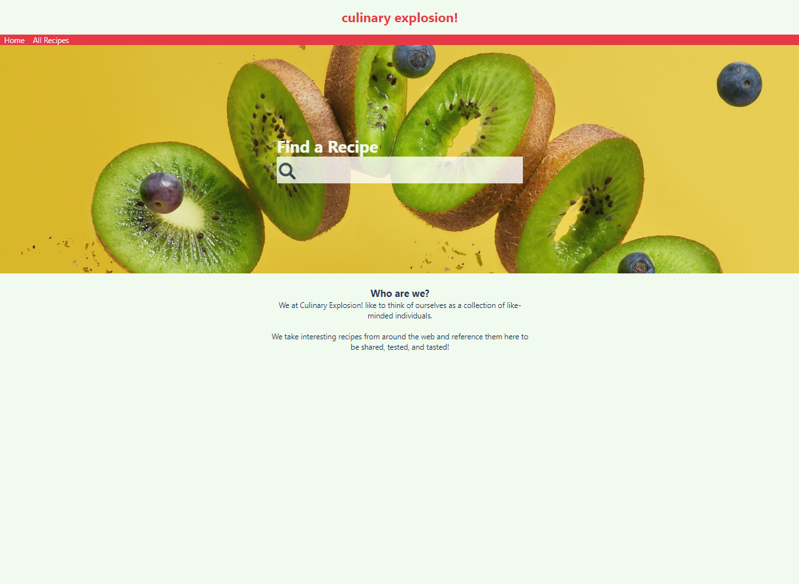
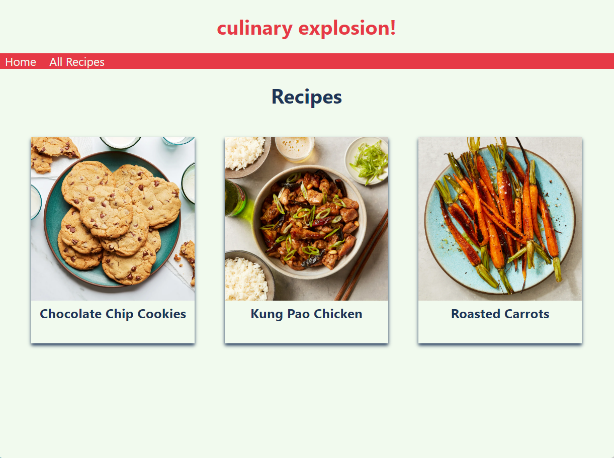
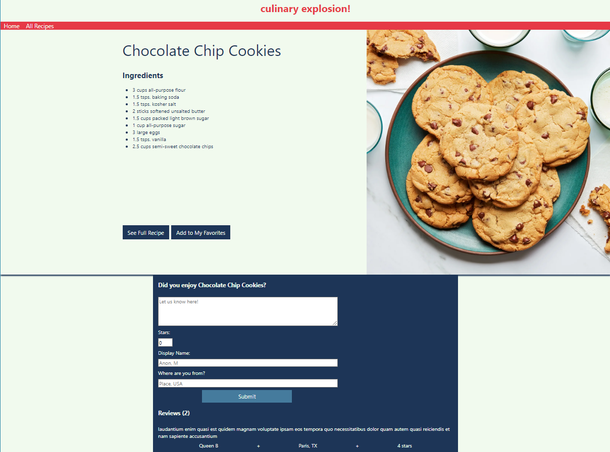
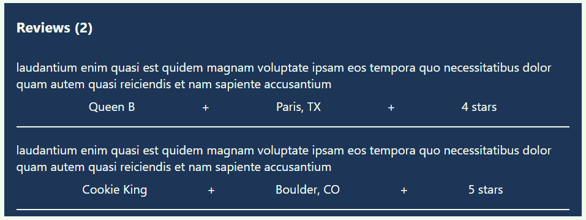
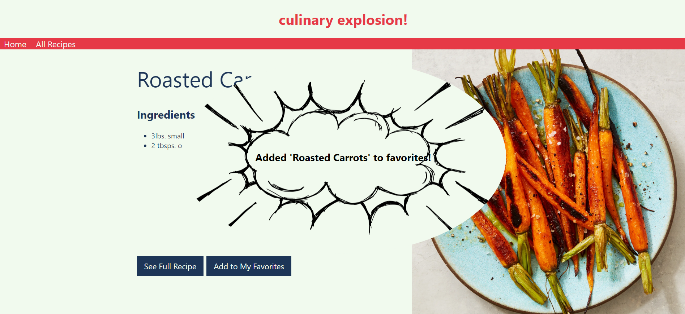

# Week 7 Review Pair Exercise
 
Congratulations. Based on your fine work on the previous recipe project, Some Recipes, Inc has invited you back to complete a more ambitious project featuring multiple recipes. 
 
This new project requires the use of Vue Router and Vuex as described in the project requirements.
 
## Application overview

This application allows the user to view a series of recipes stored in a database. Users can view the entire library of recipes, or limit the recipes by entering a search term in the home screen. 



The `MultipleRecipesView` displays the full set of recipes (either all recipes or the subset identified by a search term). In this view, each card contains the name of each recipe and its associated image:



The user can click an individual recipe card to get to the `SingleRecipeView`. This view offers additional information about the recipe, including a list of its ingredients. It also includes a collection of all current reviews of the selected recipe. Finally, it contains a form that allows the user to submit their own review:



## Starting code
 
The project that you receive is the standard Vue 2 starter project, with code added in to support Vuex and Vue Router. The starter code also contains a number of components and other files to assist you with the assignment. Before you begin coding, take a minute to review the following:
 
* The `assets` folder, which contains all photos referenced within the recipe data. 
 
* The `services` folder, which provides the data for the application.
 
* The `views` folder, which contains incomplete versions of `HomeView.vue`, `MultipleRecipesView`, and `SingleRecipeView`.

* The `components` folder, which contains a set of pre-built components, some of which require modification and others of which you can use as-is. 

* `router/index.js`, which defines the application's routes.

* `store/index.js`, which is your data store. You'll use this file to host pop-up messages that appear in response to user activity. 

## Requirements
 
**Requirement 1: Add routes to the view files**
 
Open the `index.js` file in `src/router`. Using the paths shown, create routes for the existing view files.
 
| **Component**  | **Path**     |
|----------------|--------------|
| HomeView | /|
| MulitpleRecipeView | /recipes|
| SingleRecipeView       | /recipe/:id        |

**Requirement 2: Add a nav section**

Your application must always show links to `HomeView` and `MultipleRecipeView` at the top of the screen. Inside of `App`, add a `nav` section holding links to those two views.

**Requirement 3: Add `RecipeCards` to the `MultipleRecipes` view**

Add a `RecipeCards` component so that `MultipleRecipesView` displays cards for all recipes. Be sure to pass the recipe data to the props in `RecipeCards`.

**Requirement 4: Add an event handler to individual recipe cards**

Add an event handler for each individual `RecipeCard` such that when the user clicks on a card, they move to the `SingleRecipeView` for that recipe. Be sure to set up the navigation using Vue Router.

**Requirement 5: Build `SingleRecipeView`**

Add the `RecipeDetails` component to `SingleRecipeView`. Be sure to pass the `recipe` data downstream. 

Below `RecipeDetails`, add the `ReviewSection` component. Again be sure to pass the `recipe` data downstream.

**Requirement 5: Build the `ReviewCards` component**

`ReviewCards` displays the all previous reviews for a single recipe: 



Add `ReviewCards` to the appropriate location in the `ReviewSection` component.  

**Requirement 6: Add a functioning `SearchBox` component**

Add a `SearchBox` component to the `HomeView` page.  

Currently the `searchRecipes()` function routes the user to the `MultipleRecipesPage` that displays **all** current recipes. 

Modify `searchRecipes()` so that it works as intended. When the user enters a term in `SearchBox`, route them to `MultipleRecipesView` with a subset of recipes, those whose name contains the search term.

**Requirement 7: Add pop-up messages using Vuex**

Add stylized pop-up messages that temporarily appear when the user
* Adds a recipe to their favorites
* Leaves a review



The `AppMessage` component is responsible for displaying the pop-up messages. It renders the message that's held in the datastore. 

`AppMessage` renders conditionally inside of `App`, only appearing when a message exists. Therefore, you can make a message appear by assigning `$store.state.message` something other than an empty string. Conversely, you can make `AppMessage` disappear by assigning `$store.state.message` an empty string.

**Requirement 7a: Add mutators to the datastore**

The `state` section of your datastore (`store/index.js`), contains a single variable called `message`. `message` is originally assigned an empty string.  

In the `mutations` section create the methods `SET_MESSAGE` and `CLEAR_MESSAGE`.

`SET_MESSAGE` accepts `state` and `message` as parameters, then assigns `state.message` the value of `message`. After a delay of several seconds, `SET_MESSAGE` then reassigns `message` back to an empty string.

Click here for a hint on how to [set a timer in JavaScript](#setting-a-timer).  

**Requirement 7c: Enable the `Add to Favorites` button**

In the `RecipeDetails` component, add an event listener to the `Add to Favorites` button. When the user clicks this button, have the datastore change the value of `message` to announce the addition of the current recipe to favorites.

Note that you don't have to actually maintain a list of the user's favorite recipes.

**Requirement 7d: Trigger message upon review form submit**

Modify the `ReviewSection` so that when the user user submits a new review, they receive a pop-up message confirming the receipt of the review.

## Hints

### Setting a timer

The `window.setTimeout()` method sets a timer which executes a specified method or set of code once the timer expires.

For the first parameter insert the code or method you want to implement. For the second, insert an integer representing the desired delay (in milliseconds) before the code executes.

```js
window.setTimeout(code, delay)
```