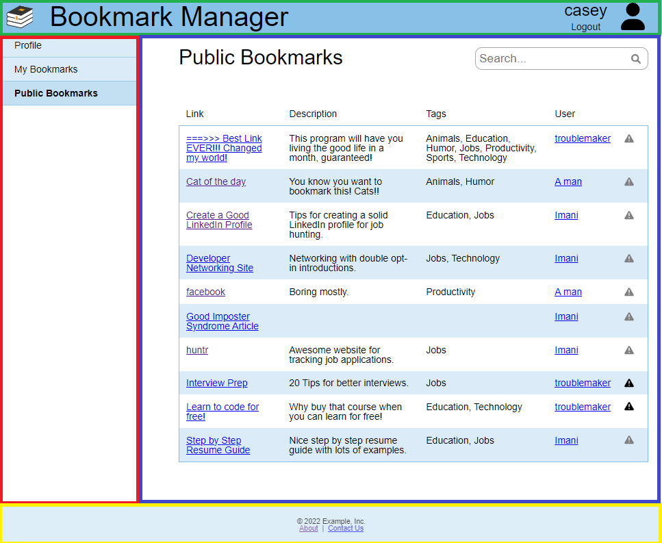
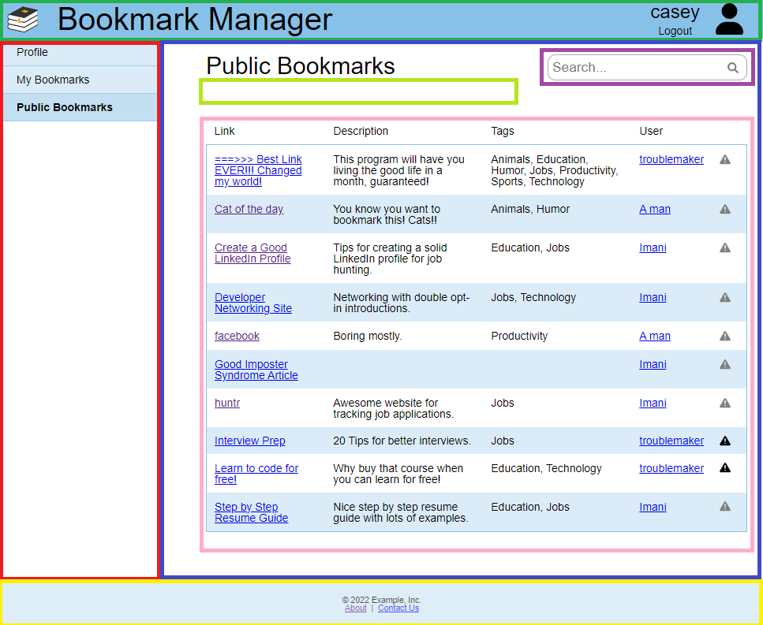
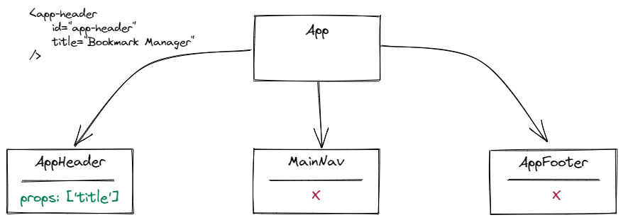
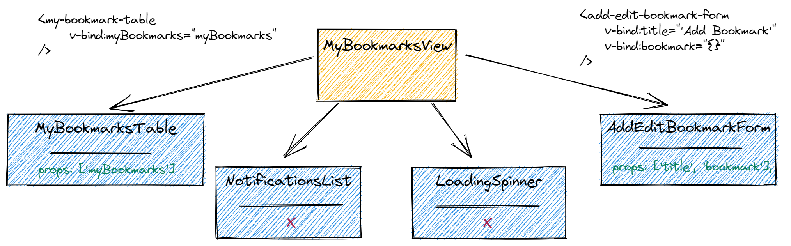

# Week 7 Review - Vue.js components and Vuex

## Primary objectives

* Structure components to serve a single purpose
* **Break larger components into multiple components**
* Import components
* **Pass data into child components using props**
* Dynamically create components
* **Explain the benefits of using Vuex**
* Create, retrieve, and update data in Vuex
* Create a new project with Vue Router using the Vue CLI
* Configure Vue Router
* Explain what the Router Link component is and how to use it
* Explain what the Router View component is and how to use it
* Use the Route Object and Router Instance to implement programmatic navigation

> Note: All examples use the Module 3 Sample Application (Bookmark Manager Web). You'll need to run `npm install` to install the dependencies and run the application with `npm run serve`. You'll also want have the Module 2 Sample Application (`bookmark-server`) running as well since it provides the API backend to this application. Refer to the `README.md` with the Module 2 application to set up the database and server.

## Objective 1: Break larger components into multiple components

### Opening

In the previous lesson students learned the benefits of designing with component-based JavaScript. This lesson is about breaking large, complex applications into manageable components. 

Review the advantages of component-based design, emphasizing the characteristics of a good component: encapsulation, single-responsibility and reusability.

With these criteria in mind, use the Module 3 sample application, Bookmark Manager Web, as your "large, complex application" and walk through breaking it into its component parts.

### Example

The Vue devtools browser extension enables you to see the component structure of a Vue project. You can use it to guide students through a component-by-component tour of the sample application. You may want to note that this is just one way to break the application into components, not the *only* way.

With the sample application running, navigate to the `PublicBookmarksView`. Begin the discussion focusing on composition in `App`. 

The following image shows `App` with a colored border surrounding each of its four child components:



* `AppHeader` (outlined in green)
* `MainNav` (outlined in red)
* `PublicBookMarksView` (outlined in blue) 
* `AppFooter` (outlined in yellow)

These components show both encapsulation and single responsibility. However they're not re-used within the application.

Continue by going deeper into the `PublicBookmarksView` and each of its child components. Here there are examples that better illustrate reusability.

The following image adds highlights for the child components within `PublicBookmarksView`:



* `SearchBox`(outlined in purple)
* `NotificationList` (outlined in light green - nothing displayed unless a notification is present)
* `PublicBookmarksTable` (outlined in pink)

While the `SearchBox` isn't currently re-used, its design supports re-use, allowing its re-use later in the `MyBookmarksView` as well. The `NotificationList` component is re-used in most of the application views.

Students may question the distinction between a *view* and a *component*. 
  - Clarify that views **are** components. They have the same structure, with a template, a script, and a style section. Like all components, views consist of standard HTML elements and other (child) components. 
  - Views are components to which you want to the user to be able to navigate. The `router/index.js` defines routes to every file within the `views` folder.
  - Views are often responsible for getting the data for their child components, passing the data in using `props`.


## Objective 2: Pass data into child components using props

### Opening

Child components often need information from their parent. This information is passed dynamically, using props. 

The sample application offers many examples in which data propagates from parent to child. When showing these relationships, highlight the connection points between the child component (which receives the props) and the parent component (which passes the props).

### Example

Begin with a basic example like `App` (parent) and `AppHeader` (child).

The `AppHeader` component declares a prop called `title`:
```js
  props: ['title']
```

The parent component, `App` must bind actual data (the string "Bookmark Manager") to the `title` prop:
```html
    <app-header id="app-header" title="Bookmark Manager"/>
```

Note that not all components have props. `MainNav` and `AppFooter` don't have any props, so `App` doesn't need to pass any data to them.

The following image illustrates how `App` passes data to the props in its child components.



Continue by discussing data propagation for `MyBookmarksView`. The following image illustrates the passing and receiving of props between `MyBookmarksView` and its child components. 



Note that components aren't limited to just one prop, the `AddEditBookmarkForm` has two props. 


## Objective 3: Explain the benefits of using Vuex

### Opening

Vuex is a state-management library for Vue applications. It stores state in a central location, providing a "single source of truth" about data. This makes data from the Vuex store accessible throughout the application. This is useful in complex projects, where many components access and modify common data values. Vuex also forces all mutations into a synchronous order so that state behaves in a predictable fashion.

### Example

The sample application uses props within a view to pass information between components. However when sharing data across multiple views, using props isn't practical. 

The sample application places two types of information in the Vuex data store:

* Data associated with the current user (including the user token). 
* Data associated with notifications, messages that display in response to a variety of user actions.

Both are examples of information sharing across multiple views.

Note the store setup in `store/index.js`:
```js
  state: {
    // auth token for logged in user
    token: currentToken || '',
    // logged in user information
    user: currentUser || {},
    // notifications are used across views to display messages to the user
    notifications: []
  },
```

Use the current user data as an example. The sample application handles this information in several of its components.

The `LoginForm` component sets the `user` and `token` using mutations:
```js
  this.$store.commit('SET_AUTH_TOKEN', response.data.token);
  this.$store.commit('SET_USER', response.data.user);
```

The `AppHeader` component then uses this information to customize the display of the header. Note that computed properties are often used to shorten the code required to access to the Vuex store. 
```js
  computed: {
    user() {
      return this.$store.state.user
    }
  }
```

This allows the template to just reference `user`. For example:
```js
<div id="user-info" v-if="user.id">
```

While it isn't necessary to cover every usage in detail, the user information is also used:
- in `PublicBookmarksTable`, similar to its use in `AppHeader`
- to set initial data in the `EditProfileForm` 
- in `router/index.js`, where the router `beforeEach` method checks the presence of an auth token to control access to certain views

## Next Steps

Notifications is another example of information shared across views. 

Many different components throughout the application create notifications. Notifications are also displayed in most of the application views. However the `NotificationList` component manages the display of the notifications. This component is then used in each view.

The registration and/or login process are straightforward examples to use for discussing notifications. 
- The LoginForm was previously used as an example, so it may be beneficial to use to further the discussion. However it also uses Vuex for user information. 
- The `RegisterUserForm` and `RegisterUserView` would be new examples, but only use the store for notifications.

Vuex provides a sensible approach for sharing notification data across numerous views and components. By putting `notifications` in the data store, each view has direct access to the current notifications. Also, since the store handles updates through mutations, Vuex also ensures that updates to notifications from many different components behaves in a predictable fashion.