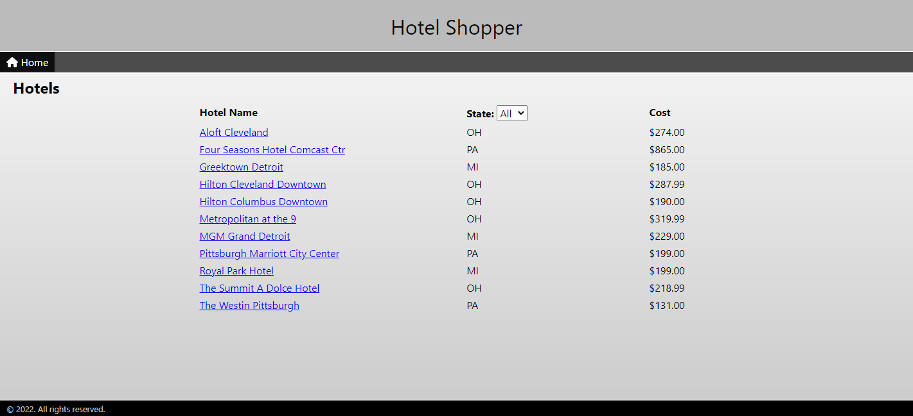

# Week 8 Review Pair Exercise

In this exercise, you'll practice connecting a "frontend" Vue application to a "backend" API which serves data stored in a database. When you have finished, you'll have a complete, end-to-end, full-stack web application.



## Application overview

This application allows a user to shop for hotels. After selecting a hotel, the user can create, read, update, and delete hotel reservations.

The user interface is complete, as well as the API—your focus in this exercise is to write the code to retrieve data from the API for display, and send data to the API for update.

## Starting code

The code that you received to start this exercise has 4 top-level folders:

* The `client` folder contains the Vue frontend application. It includes Vue Router and Vuex.
* The `database` folder contains a script to create and populate a PostgreSQL database.
* The `postman` folder contains a Postman collection of requests that exercise all the API endpoints.
* The `server` folder contains a Java Spring MVC project that implements a Hotel API.

## Hotel API

These are the endpoints in the Hotel API. For details on the properties of each type of data, see the sample data in the sections that follow.
| Endpoint | Description | Request | Response |
| --- | --- | --- | --- |
| `GET /hotels` | List all hotels. | - | `List<Hotel>` | 
| `GET /hotels?state=OH&city=Cleveland` | List hotels filtered by state and city. Both parameters are optional. | - | `List<Hotel>` | 
| `GET /hotels/states` | List all states in which there are hotels. States returned as two-letter abbreviations. | - | `List<String>` |
| `GET /hotels/{id}` | Get the hotel with `hotelId` == `id`. | - | `Hotel` |
| `GET /hotels/{id}/reservations` | List all reservations for the hotel with `hotelId` == `id`. | - | `List<Reservation>` |
| `GET /reservations` | List all reservations in the system. | - | `List<Reservation>` |
| `GET /reservations/{id}` | Get the reservation with `reservationId` == `id`. | - | `Reservation` |
| `POST /reservations` | Add a new reservation. | `Reservation` | `Reservation` |
| `PUT /reservations/{id}` | Update the reservation with `reservationId` == `id`. | `Reservation` | `Reservation` |
| `DELETE /reservations/{id}` | Delete the reservation with `reservationId` == `id`. | - | - |

### Hotel sample data

```json
{
    "id": 1,
    "name": "Aloft Cleveland",
    "address": {
        "id": "d3494dd3-e8f2-442f-abf2-3670d81ee051",
        "address": "1111 W 10th St",
        "address2": null,
        "city": "Cleveland",
        "state": "OH",
        "zip": "44115"
    },
    "stars": 4,
    "roomsAvailable": 48,
    "costPerNight": 274.0,
    "coverImage": "aloft.png"
}
```

### Reservation sample data

```json
{
    "id": 4,
    "hotelId": 1,
    "fullName": "Leopoldine Drovin",
    "checkinDate": "2022-09-29",
    "checkoutDate": "2022-10-04",
    "guests": 4
}
```

### State sample data

```json
[
    "MI",
    "OH",
    "PA"
]
```

## Getting started

### Database

1) Open PGAdmin.
2) Create a new database called `hotelDB`.
3) Open the script file `database/hotelDB.sql` in a query window, and execute the script.

### Server

1) Open the project in the `server` folder in IntelliJ.
2) Start the server by running `src/main/java/com/techelevator/reservations/HotelReservationsApplication.main()`.

### Postman

1) Import the collection into Postman. 
2) With the server running, you can execute any of the requests in the collection. 

This is a great way to understand the API, and it shows you exactly what data to send to and expect from each API endpoint.

### Client

1) Open the project in the `client` folder in Visual Studio Code.
2) In a terminal window, resolve dependencies by running `npm install`.
3) Start the application by running `npm run serve`.
4) Ctrl-Click the local URL to launch the application in the browser.

## Requirements

You'll see placeholders in a number of files in this project, indicating where you need to add some code. These placeholders start with `// TODO:`. You can search for "TODO:" to see all the places you need to do some work, but if you use the following requirements, you'll get to each one. 

### HotelService.js

The file `services/HotelService.js` contains a service object intended to make Axios calls to the API. You are to add functions to this object as needed by the application's views. For example, when you need to call the API to get a list of hotels, you'll add a function to this file so that it looks something like this:

```javascript
export default {
  // TODO: Add any Axios calls to the API as functions in this service object
  getHotels() {
    return axios.get('/hotels');
  },
}
  ```

Keep this in mind as you work your way through the rest of the requirements.

### Home page

The "home" route, `/`, routes to `HotelsView` to display all the hotels in a list, and allows the user to filter by state.

* Inside `views/HotelsView.vue`, you need to implement the following methods to get data from the server:
    * `getHotels()`
    * `getStates()`
    * `searchHotels()`
* You also need to implement the `created()` Vue lifecycle function, so that when Vue creates the component, you call `getHotels()` and `getStates()`.

Whenever you need to implement methods such as these to get data from the server, you must:

* Create a function in the service object to make the Axios call.
* Call the service function from the component, passing appropriate parameters if needed.
* Handle a successful response (`then`) and assign data to a Vue property as indicated in the `TODO:`.
* Handle an error (`catch`) appropriately. You can use the `alert` function to inform the user of an error.

> TIP: Don't forget to add the `import` for the service object.

**When you complete this requirement correctly, you can run the application and see hotels listed on the home page. The `states` filter contains three states, and when you select one, you see the filtered list.**

### Hotel details view

This view displays a single hotel, and a list of the existing reservations for that hotel.

* Implement these methods:
    * `getHotels()`
    * `getReservations()`

**When you complete this requirement correctly, you can click a hotel name on the home page, and the details page displays the hotel details. You can click 'Show hotel reservations' and see a list of reservations for the hotel. Note that not all hotels have reservations on them.**

### Add reservation view

This view allows the user to add a reservation for the hotel id passed in the route path.

* Implement these methods:
    * `addReservation()`

**When you complete this requirement correctly, you can click 'Book new reservation' on the hotel details page and see this view. When you click 'Save', you see the hotel details page again, and the new reservation is in the list.**

### Update reservation view

This view allows the user to view and update a reservation for the reservation id passed in the route path.

* Implement these methods:
    * `getReservation()`
    * `updateReservation()`
* You also need to implement the `created()` Vue lifecycle function, so that when Vue creates the component, you call `getReservation()`, passing in the `id` path parameter from the route.

**When you complete this requirement correctly, you can click the 'edit' icon next to a reservation on the hotel details page and see this view. When you click 'Save', you see the hotel details page again, and the updated reservation is in the list.**

### Delete reservation view

This view allows the user to view and update a reservation for the reservation id passed in the route path.

* Implement these methods:
    * `getReservation()`
    * `deleteReservation()`
* You also need to implement the `created()` Vue lifecycle function, so that when Vue creates the component, you call `getReservation()`, passing in the `id` path parameter from the route.

**When you complete this requirement correctly, you can click the 'delete' icon next to a reservation on the hotel details page and see this view. When you click 'Delete', you see the hotel details page again, and this reservation is no longer in the list.**
