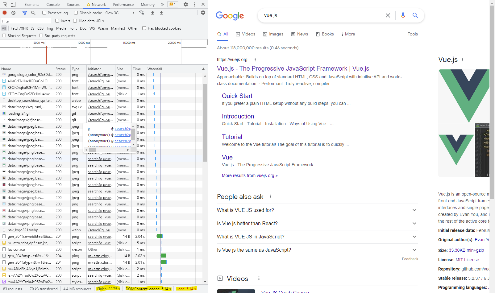

# Week 8 Review - Asynchronous JavaScript and Web Services

## Primary objectives

- Make an HTTP GET request to a RESTful web service using the Axios library and process the response
- **Explain why asynchronous coding techniques are frequently used in JavaScript for interacting with server-side components**
- Explain the difference between synchronous and asynchronous code
- Explain what a promise is and how it works
- **Build a service object for interacting with a RESTful web service**
- Use the Vue component `created()` lifecycle hook to call a web API to retrieve data when a view is rendered
- Make POST, PUT, and DELETE requests using Axios
- Catch and handle errors using Axios
- **Explain what Cross-Origin Resource Sharing is and how it works**
- Explain the cross-origin request process
- Explain why developers might encounter CORS errors when testing APIs on localhost

## Objective 1: Explain why asynchronous coding techniques are frequently used in JavaScript for interacting with server-side components

### Opening

There and back again: a web request's tale.

Web requests take time to travel from your browser to the server and have its result returned to you.

Compare synchronous and asynchronous code with students and discuss how they each apply to the basic flow of a web request.

If all client code interactions with server-side components were synchronous, and *every* request took just 0.1 seconds, many websites today would be slow and unresponsive. Executing this code asynchronously helps the many moving parts of a web application move efficiently and independently.

### Example

The reading uses a restaurant as an analogy for asynchronous programming. Another analogy you may use is kids returning from school and either going home by bus (synchronously) or returning home separately (asynchronously).

Search for something on Google, then open the network tab in Chrome DevTools and refresh the page. Observe the number of web requests and contrast the page's current load time with the time for every request to complete.

Then ask the group what would happen if the page loaded synchronously. Would they wait 10 seconds for a page to load? How about 20 or more seconds?



### Next steps

You've explained why programmers frequently use asynchronous techniques in JavaScript. Now, it's time to cover how. Explain what a JavaScript `promise` is and how it relates to the `then()` method.

While the next objective allows you to demonstrate asynchronous code using the sample project, feel free to exhibit other examples of asynchronous JavaScript code.

## Objective 2: Build a service object for interacting with a RESTful web service

### Opening

Students need to know what a service object is, how it promotes encapsulation, and how to use it throughout an application.

The benefits of using service objects are similar to that of components—both encourage:
- Encapsulation
- Reusability
- Single-responsibility

Common questions:
- Do service objects have to call an API?
- Are service objects classes?
- If you use a service object a lot in an application, is it a good idea to declare it globally?

### Example

Be sure to break down the structure of a service object with students.

You can walk through an existing service object in the sample application or create a new service and call a public API like [https://api.chucknorris.io/jokes/random](https://api.chucknorris.io/jokes/random).

Creating a new service object may give you more control over what components of a service object to show students, like using the configuration object in the Axios `create()` function:

```JavaScript
const http = axios.create({
  baseURL: "https://api.chucknorris.io/"
});
```
Once students know what makes a service object, you can further leverage the sample application to demonstrate how to use it.

Explore the usages of service objects in the sample application and, if you'd like, add your new service object to the application. Be sure to note that Axios API calls are asynchronous and explain how the `.then()` method handles them.

Upon looking over the sample application's service objects students may notice, and even call out, that these objects don't set a value for the `baseURL` in Axios.

This makes it a good time to show how the application overrides the default value for `baseURL` in `main.js` using an environment variable.

Explain why using environment variables for configuration information is a best practice. If you have time, show the group how to create new environment variables within the `.env` file. If you made a new service object, you can create an environment variable for the new API and show how to use that.

> Note: When using `.env` files with Vue, all variable names must start with `VUE_APP_`. You must stop and restart the server to load any changes to the `.env` file, hot-reloading doesn't re-read the file.

## Objective 3: Explain what Cross-Origin Resource Sharing is and how it works

### Opening

A web application may use resources from many different places within the application itself and from other websites or origins.

Discuss what an origin is, and show some examples of different origins:

| Protocol | Domain | Port |
|---|---|---|
|https|www.example.com|:443|
|http|www.example.com|:80|
|https|www.google.com|:443|
|http|localhost|:8080|
|http|localhost|:3000|

>Note: Adding paths and parameters to your examples may help students understand that an origin is only the protocol, port, and domain.

With origin defined, introduce the same-origin policy implemented by web browsers and why it exists.

So how does a web application access resources from a different origin? The answer is with CORS.

When explaining CORS, be sure to cover:
- What makes a cross-origin HTTP request cross-origin.
- The `Origin` request header and `Access-Control-Allow-Origin` response header.
- Allowing specific domain access with `Access-Control-Allow-Origin: https://www.example.com`.
- Allowing any domain/public access with `Access-Control-Allow-Origin: *`.

A common misconception mentioned in the reading is that CORS doesn't apply when both applications run on localhost but on different **ports**.

Students may now ask how they can enable CORS in their API projects. Introduce using the `@CrossOrigin` annotation on controllers/methods in a Spring Boot application:

```Java
@CrossOrigin
@RestController
@RequestMapping("/example")
public class ExampleController {
    // ...
}
```

You can take this one step further and demonstrate how you can allow specific origins access with the `CrossOrigin` annotation's `origins` attribute:

```Java
@CrossOrigin(origins = "https://www.example.com")
public class ExampleController {
    // ...
}
// or
@CrossOrigin(origins = {"https://www.example.com", "http://foo.com"})
public class ExampleController {
    // ...
}
```

Common questions:
- Do you have to use the cross-origin annotation on every method?
- Does the same-origin policy prevent cross-site scripting attacks?
- What other attributes does the cross-origin annotation have?